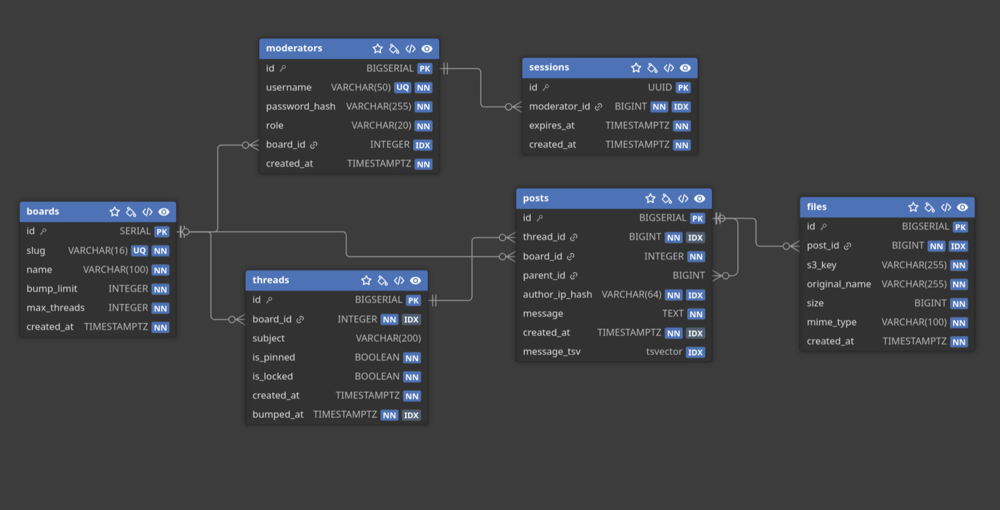

# Project documentation

This directory contains the database schema and its entity-relationship diagram for the imageboard backend.

- [`db.sql`](./db.sql) defines the PostgreSQL tables, relationships, defaults, and indexes. Apply it to an empty database when setting up the backend; Docker Compose starts PostgreSQL but does not load this schema automatically. See the [backend setup guide](../backend/README.md) for the full setup steps.
- [`er.png`](./er.png) provides a visual overview of the database entities and their relationships.

## Entity-relationship diagram

## Schema overview

The core content model is `boards` → `threads` → `posts`. Posts can reference another post through `parent_id`, and may have associated entries in `files`. Moderator accounts are stored in `moderators`, with login sessions in `sessions`.

Deleting a board cascades to its threads, posts, files, and board-scoped moderators. Deleting a thread cascades to its posts and files. Deleting a post sets `parent_id` to `NULL` on replies that referenced it.

The schema also defines indexes for board thread ordering, post lookup by thread and IP hash, full-text search over messages, files by post, and sessions by moderator.
